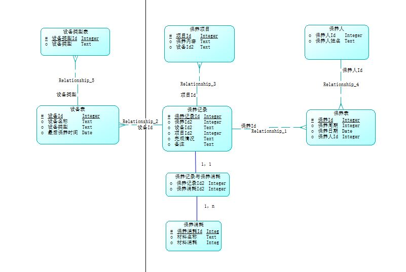
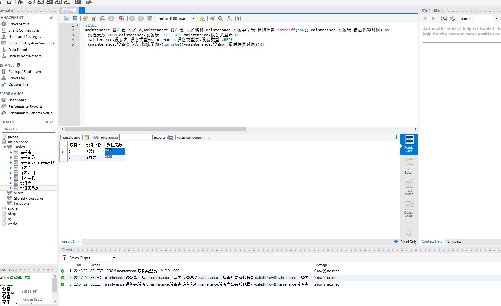

# SADM
##一、ER图

##二、Axure设计原型
[Axure原型图](电器设备保养.rp)
##三、Data数据
####（1）[保养记录表](数据/设备保养系统模型_equipmentmaintain.sql)  
USE maintenance;
select 保养表.保养日期 from where 保养记录.保养Id=保养表.保养Id
select 材料名称，材料消耗 from where 保养记录.保养记录Id=保养记录与保养消耗.保养记录Id2 and
 保养消耗.保养消耗Id=保养记录与保养消耗.保养消耗Id 
  

####（2）[检修报告表](数据/设备保养系统模型_examinereport.sql)  
SELECT 
maintenance.设备表.设备Id,maintenance.设备表.设备名称,maintenance.设备类型表.检修周期-datediff(now(),maintenance.设备表.最后保养时间) as
 到检天数 FROM maintenance.设备表 LEFT JOIN maintenance.设备类型表 ON 
 maintenance.设备表.设备类型=maintenance.设备类型表.设备类型 WHERE
 (maintenance.设备类型表.检修周期-(curdate()-maintenance.设备表.最后保养时间))<3
  

##四、数据库
/*
Navicat MySQL Data Transfer

Source Server         : 233
Source Server Version : 50712
Source Host           : localhost:3306
Source Database       : maintenance

Target Server Type    : MYSQL
Target Server Version : 50712
File Encoding         : 65001

Date: 2016-10-09 17:40:29
*/

SET FOREIGN_KEY_CHECKS=0;

-- ----------------------------
-- Table structure for 保养人
-- ----------------------------
DROP TABLE IF EXISTS `保养人`;
CREATE TABLE `保养人` (
  `保养人Id` int(11) NOT NULL AUTO_INCREMENT,
  `保养人姓名` varchar(255) NOT NULL,
  PRIMARY KEY (`保养人Id`)
) ENGINE=InnoDB DEFAULT CHARSET=utf8;

-- ----------------------------
-- Records of 保养人
-- ----------------------------

-- ----------------------------
-- Table structure for 保养消耗
-- ----------------------------
DROP TABLE IF EXISTS `保养消耗`;
CREATE TABLE `保养消耗` (
  `保养消耗Id` int(11) NOT NULL,
  `材料名称` varchar(255) DEFAULT NULL,
  `材料消耗` int(11) DEFAULT NULL,
  PRIMARY KEY (`保养消耗Id`)
) ENGINE=InnoDB DEFAULT CHARSET=utf8;

-- ----------------------------
-- Records of 保养消耗
-- ----------------------------

-- ----------------------------
-- Table structure for 保养表
-- ----------------------------
DROP TABLE IF EXISTS `保养表`;
CREATE TABLE `保养表` (
  `保养Id` int(11) NOT NULL AUTO_INCREMENT,
  `保养周期` int(11) DEFAULT NULL,
  `保养日期` date DEFAULT NULL,
  `保养人Id` int(11) DEFAULT NULL,
  PRIMARY KEY (`保养Id`),
  CONSTRAINT `R_1` FOREIGN KEY (`保养Id`) REFERENCES `保养人` (`保养人Id`)
) ENGINE=InnoDB DEFAULT CHARSET=utf8;

-- ----------------------------
-- Records of 保养表
-- ----------------------------

-- ----------------------------
-- Table structure for 保养记录
-- ----------------------------
DROP TABLE IF EXISTS `保养记录`;
CREATE TABLE `保养记录` (
  `保养记录Id` int(11) NOT NULL,
  `保养Id` int(11) DEFAULT NULL,
  `设备Id` int(11) DEFAULT NULL,
  `项目Id` int(11) DEFAULT NULL,
  `完成情况` varchar(255) DEFAULT NULL,
  `备注` varchar(255) DEFAULT NULL,
  PRIMARY KEY (`保养记录Id`),
  KEY `R_3` (`项目Id`),
  KEY `R_4` (`设备Id`),
  CONSTRAINT `R_2` FOREIGN KEY (`保养记录Id`) REFERENCES `保养表` (`保养Id`),
  CONSTRAINT `R_3` FOREIGN KEY (`项目Id`) REFERENCES `保养项目` (`项目Id`),
  CONSTRAINT `R_4` FOREIGN KEY (`设备Id`) REFERENCES `设备表` (`设备Id`)
) ENGINE=InnoDB DEFAULT CHARSET=utf8;

-- ----------------------------
-- Records of 保养记录
-- ----------------------------

-- ----------------------------
-- Table structure for 保养记录与保养消耗
-- ----------------------------
DROP TABLE IF EXISTS `保养记录与保养消耗`;
CREATE TABLE `保养记录与保养消耗` (
  `保养记录Id` int(11) NOT NULL,
  `保养消耗Id` int(11) DEFAULT NULL,
  PRIMARY KEY (`保养记录Id`)
) ENGINE=InnoDB DEFAULT CHARSET=utf8;

-- ----------------------------
-- Records of 保养记录与保养消耗
-- ----------------------------

-- ----------------------------
-- Table structure for 保养项目
-- ----------------------------
DROP TABLE IF EXISTS `保养项目`;
CREATE TABLE `保养项目` (
  `项目Id` int(11) NOT NULL,
  `保养内容` varchar(255) DEFAULT NULL,
  `设备Id` varchar(255) DEFAULT NULL,
  PRIMARY KEY (`项目Id`)
) ENGINE=InnoDB DEFAULT CHARSET=utf8;

-- ----------------------------
-- Records of 保养项目
-- ----------------------------

-- ----------------------------
-- Table structure for 设备类型表
-- ----------------------------
DROP TABLE IF EXISTS `设备类型表`;
CREATE TABLE `设备类型表` (
  `设备类型Id` int(11) NOT NULL,
  `设备类型` varchar(255) DEFAULT NULL,
  PRIMARY KEY (`设备类型Id`),
  KEY `设备类型` (`设备类型`)
) ENGINE=InnoDB DEFAULT CHARSET=utf8;

-- ----------------------------
-- Records of 设备类型表
-- ----------------------------

-- ----------------------------
-- Table structure for 设备表
-- ----------------------------
DROP TABLE IF EXISTS `设备表`;
CREATE TABLE `设备表` (
  `设备Id` int(11) NOT NULL,
  `设备名称` varchar(255) DEFAULT NULL,
  `设备类型` varchar(255) DEFAULT NULL,
  `最后保养时间` date DEFAULT NULL,
  PRIMARY KEY (`设备Id`),
  KEY `R_5` (`设备类型`),
  CONSTRAINT `R_5` FOREIGN KEY (`设备类型`) REFERENCES `设备类型表` (`设备类型`)
) ENGINE=InnoDB DEFAULT CHARSET=utf8;

-- ----------------------------
-- Records of 设备表
-- ----------------------------
